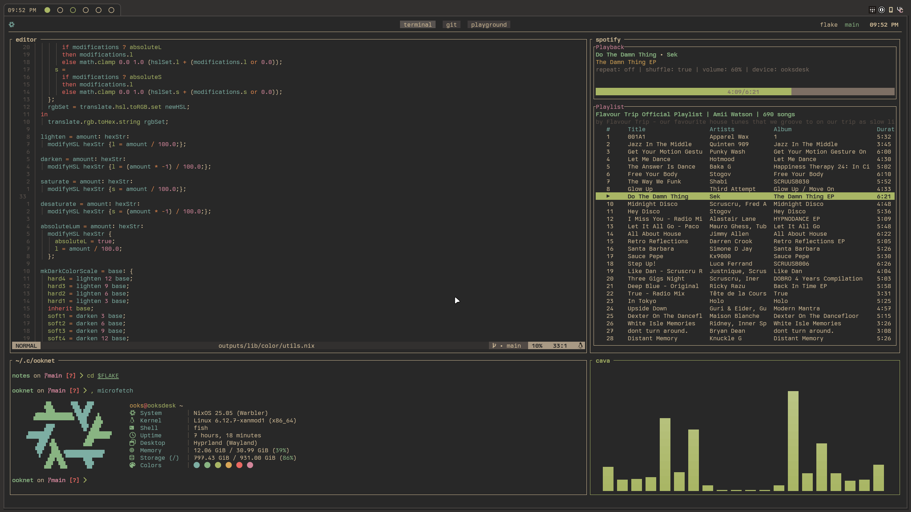

<h1 align=center> ooknet </h1>
<p align= center>A monorepo for all my nix expressions powered by flake-parts.</p>

## Overview

This repository serves two main purposes:

1. To serve as a centralized location for all my personal computing
   infrastructure
2. To provide a place to experiment and learn about networking, administration,
   security, unix, design, and programming

> [!WARNING]
> This repository is not intended to be used by anyone but myself. It is highly
> personalized and likely doesn't fit anyone else's needs. I leave this
> repository public to serve as a reference for anyone else building something
> similar.

## Features

- NixOS configurations for all my hosts
- Home-manager configuration for my workstations
- Custom packages
- Development environments
- Declarative secrets with agenix
- Personal website
- Templates for bootstrapping projects

## Fleet

Below are all the hosts I currently maintain within this flake:

| host      | spec                                  | role        | description                       | architecture | status |
| --------- | ------------------------------------- | ----------- | --------------------------------- | ------------ | ------ |
| ooksdesk  | 7500F / RX5700XT / 32 GB DDR5         | Workstation | Primary desktop workstation       | x86_64-linux | UP     |
| ookst480s | T480s / i5-8350U / 24 GB DDR4         | Workstation | Primary mobile workstation        | x86_64-linux | UP     |
| ooksmicro | GPD Micro PC / N8100 / 8 GB LPDR3     | Workstation | Pocket workstation                | x86_64-linux | UP     |
| ooksmedia | i3-10100 / 1650 Super / 8 GB DDR4     | Server      | Homelab/Media server              | x86_64-linux | UP     |
| ooksx1    | X1 Carbon G4 / i5 6200U / 8 GB LPDDR3 | Workstation | Alternative mobile workstation    | x86_64-linux | DOWN   |
| ooknode   | Linode Nanode                         | Server      | VPS for website                   | x86_64-linux | UP     |
| ooksphone | Termux                                | Workstation | Nix environment for android phone | x86_64-linux | DOWN   |

## Architecture

As this project serves as a learning environment, its architecture changes
frequently. While I'll try to keep this documentation current, what follows is a
high-level overview of the current design.

One of the main goals of this project was to allow for easy bootstrapping of new
hosts while maintaining fine-grained configuration on a per-host basis. This is
accomplished using a roles and profiles pattern (similar to
[Puppet's roles and profiles method](https://www.puppet.com/docs/puppet/7/the_roles_and_profiles_method.html)).

#### Roles

- **Workstation**: Desktop/laptop systems with GUI environment
- **Server**: Headless systems running specific services

Roles are declared via their own respective helper functions `mkWorkstation` and
`mkServer`. Both being simple wrappers of
[`lib.nixosSystem`](https://github.com/NixOS/nixpkgs/blob/e5db80ae487b59b4e9f950d68983ffb0575e26c6/flake.nix#L21)
(also see [`lib.evalModules`](https://noogle.dev/f/lib/evalModules)). These
functions serve to abstract the boilerplate, leaving a simple interface for
declaring hosts.

Example:

```nix
flake.nixosConfigurations = {
  ookst480s = mkWorkstation {
    inherit withSystem;
    system = "x86_64-linux";
    hostname = "ookst480s";
    type = "laptop";
  };
  ooknode = mkServer {
    inherit withSystem;
    system = "x86_64-linux";
    hostname = "ooknode";
    domain = "ooknet.org";
    type = "vm";
    profile = "linode";
    services = ["website" "forgejo"]; 
  };
};
```

#### Profiles

Profiles are collections of related software and configurations that can be
enabled on a per-host basis. Here are some example profiles for workstations:

- `gaming`: Steam & emulators
- `communication`: Discord, Teams, Matrix
- `productivity`: Document editing, note-taking
- `creative`: Art and design tools
- `media`: Audio/video playback and management
- `virtualization`: Virtual machine support

Example configuration:

```nix
ooknet.workstation.profiles = ["gaming" "creative" "media"];
```

For servers, profiles are defined as services. For example:

- `ookflix`: Media server services
- `forgjo`: Git server
- `website`: My static website

```nix
ooknet.server.services = ["ookflix"];
```

## Desktop environment


All workstations currently run a minimal wayland configuration made from a few
components:

- [Hyprland](https://github.com/hyprwm/Hyprland)
- Hypr* ware ([hypridle](https://github.com/hyprwm/hypridle),
  [hyprlock](https://github.com/hyprwm/hyprlock),
  [hyprpaper](https://github.com/hyprwm/hyprpaper))
- [Waybar](https://github.com/Alexays/Waybar)
- [Mako](https://github.com/emersion/mako)
- [Gruvbox extended](https://github.com/ooks-io/ooknet/blob/main/outputs/hozen/default.nix)

## Appreciation

I want to give some appreciation to the many people/resources who have helped in
some way to build this project.

### People

- [ghuntley](https://github.com/ghuntley)
- [NobbZ](https://github.com/NobbZ)
- [notashelf](https://github.com/NotAShelf)
- [mic92](https://github.com/Mic92)
- [fabaff](https://github.com/fabaff)
- [gerg-l](https://github.com/Gerg-L)
- [viperML](https://github.com/viperML)
- [colemickens](https://github.com/colemickens)
- [fufexan](https://github.com/fufexan)
- [max-privatevoid](https://github.com/max-privatevoid)

### Resources

- [nix.dev](https://nix.dev/)
- [noogle](https://noogle.dev/)
- [nix-pills](https://nixos.org/guides/nix-pills/)
